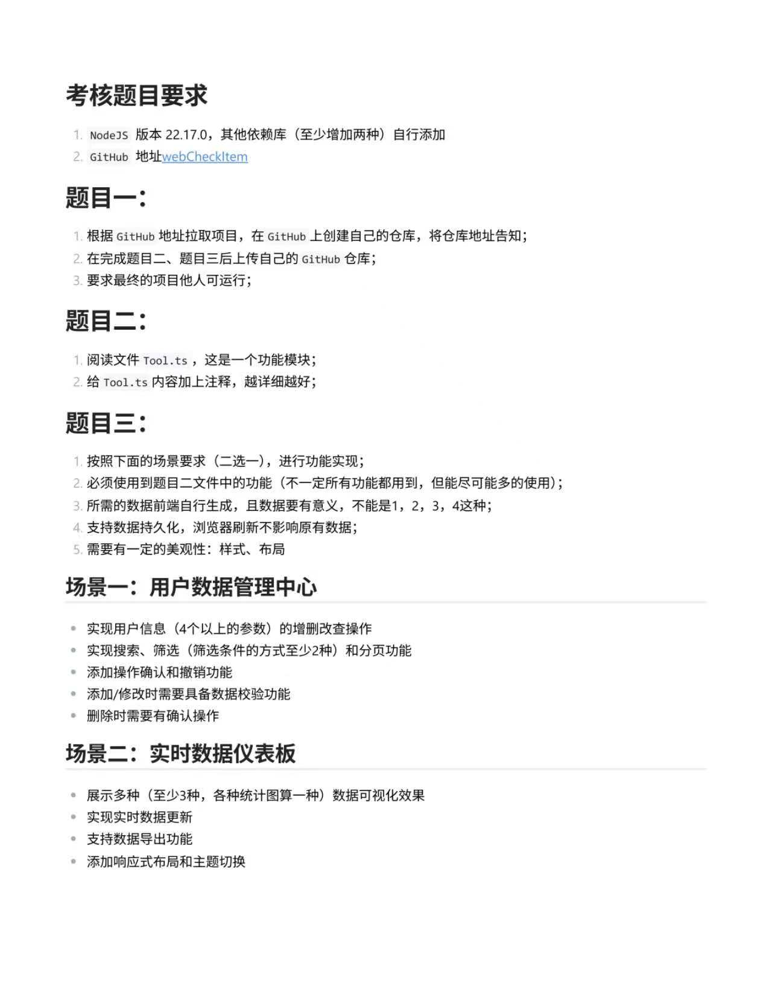

## 题目

## 在线预览
[在线预览](http://litu.dreamsoul.cn)

## 改动说明
使用proto提供的cli工具，生成了person-proto.js和person-proto.d.ts两个文件。  
使用public/person.json模拟数据，将其转化为protobuf对象，然后在前端展示。  
在右上方放置了proto按钮展示。  
> 相关逻辑在src\components\ProtoInfo.vue中。  
